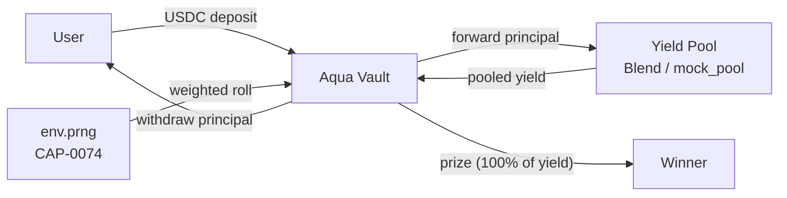

# Aqua — No-Loss Prize-Linked Savings on Stellar

A complete end-to-end MVP for prize-linked savings on Stellar. Deposit USDC into a shared vault, earn yield through Blend (or a mock pool), and every draw period one depositor wins 100% of the pooled yield — chosen by verifiable on-chain randomness (CAP-0074). Your principal is always fully withdrawable.

## Architecture



Deposits flow **user → vault → yield pool** and start earning immediately; the draw period ends with the vault pulling the accrued **yield pool → vault** and paying it out as a **prize → winner**, who is selected by a weighted `env.prng()` roll. Principal is always withdrawable **vault → user** in full.

- **Smart Contract** (`contracts/aqua_vault`): Soroban vault managing deposits, yield routing, and weighted-random prize draws using `Env::prng()` (CAP-0074). Written in Rust with soroban-sdk 27.0.5.
- **Mock Pool** (`contracts/mock_pool`): Deployable stand-in for Blend with simple-interest accrual, allowing testnet deployment without external dependencies.
- **Frontend** (`frontend/`): Next.js + Tailwind responsive UI with Freighter wallet integration, deposit/withdraw actions, live countdown, and draw history.
- **Deploy Scripts** (`scripts/deploy.sh`): End-to-end testnet deployment — builds contracts, deploys pool + vault, issues test USDC SAC, wires everything together, and outputs environment variables for the frontend.

## Prerequisites

- **Rust** (latest stable): `curl --proto '=https' --tlsv1.2 -sSf https://sh.rustup.rs | sh`
- **Stellar CLI** (>= 22.0.0): `cargo install --locked stellar-cli --features opt`
- **Node.js** (>= 18): for the frontend
- **Funded Stellar testnet account**: Run `stellar keys generate default --network testnet` then fund it at https://laboratory.stellar.org/#account-creator

Configure your Stellar CLI:
```bash
stellar keys generate default --network testnet  # if you don't have a key yet
stellar network add \
  --global testnet \
  --rpc-url https://soroban-testnet.stellar.org:443 \
  --network-passphrase "Test SDF Network ; September 2015"
```

## Build and Test

```bash
# Build both contracts to optimized WASM
make build

# Run all unit tests (vault + mock pool)
make test

# Run only vault tests (17 tests incl. statistical + fuzz checks)
make test-vault

# Run only mock pool tests
make test-pool
```

**Test highlights:**
- `test.rs` includes 15 comprehensive tests: initialization, deposit/withdraw flows, authorization, prize draws with proportional probability verification (6000-iteration statistical test), zero-yield edge case, and error paths.
- `test_draw.rs` runs 2,000 consecutive full prize draws across 8 depositors and asserts the win distribution converges to each balance's share of principal (±2%), plus zero-loss on total exit.
- `fuzz_test.rs` drives 1,002 deterministic pseudo-random actions (deposits, withdrawals, draws, rate changes) across 3 seeds, re-asserting the storage invariants after every step.
- All 22 tests (vault + pool) pass with soroban-sdk 27.0.5.

**WASM size guardrail:**
```bash
# Build both contracts as optimized WASM and print a size report
make wasm-size
# or, with a baseline for delta comparison (e.g. a base-branch build):
scripts/analyze_wasm.sh --baseline /path/to/base/target
```
The analyzer prints raw + gzipped artifact sizes and a top-sections breakdown (via `wasm-tools objdump`), then fails the build if any artifact exceeds the thresholds:

| Threshold | Default | Meaning |
| --- | --- | --- |
| `MAX_WASM_KB` | `200` | Hard cap per artifact. Soroban's ledger class-size limit is 2 MB; 200 KB catches accidental bloat early. |
| `MAX_WASM_DELTA_KB` | `15` | Allowed growth vs a baseline build (used with `--baseline`), blocking silent size regressions. |

CI runs this check on every PR (`contract-wasm-size` job), comparing against a baseline build of the base branch, so a PR that adds an expensive dependency fails visibly before merge. Raw size is what gets charged against the class-size limit and drives upload/storage fees; gzipped size is a proxy for upload cost; the `code` section grows with every helper and panic string.

## Deploy to Testnet

### One-command deployment

```bash
make deploy
```

This runs the full pipeline: builds both contracts, deploys the mock pool + USDC SAC + vault, initializes them with a 10% annual rate and 24-hour draw interval, and prints the contract addresses.

### Step-by-step (manual control)

If you want to control each phase separately:

1. **Setup identity and fund it:**
   ```bash
   make setup ADMIN_IDENTITY=aqua_admin
   ```
   Creates the `aqua_admin` keypair and funds it via Friendbot.

2. **Deploy contracts:**
   ```bash
   make build
   ./scripts/02_deploy.sh aqua_admin testnet
   ```
   Deploys mock pool, issues test USDC SAC (with pool as admin so it can mint interest), deploys vault. Writes contract IDs to `.env.contract_id`.

3. **Initialize contracts:**
   ```bash
   ./scripts/03_initialize.sh aqua_admin testnet
   ```
   Initializes pool (10% annual rate) and vault (24h draw interval). Reads `.env.contract_id`.

**Save the output** — you'll need these addresses for the frontend:
```
NEXT_PUBLIC_VAULT_ID=C...
NEXT_PUBLIC_POOL_ID=C...
NEXT_PUBLIC_USDC_ID=C...
NEXT_PUBLIC_NETWORK=testnet
```

## Frontend Setup

1. **Install dependencies:**
   ```bash
   make frontend-install
   # or: cd frontend && npm install
   ```

2. **Configure environment:**
   ```bash
   cd frontend
   cp ../.env.example .env.local
   # Edit .env.local and paste the contract addresses from deploy output
   ```

3. **Run development server:**
   ```bash
   make frontend-dev
   # or: cd frontend && npm run dev
   ```
   Open http://localhost:3000

4. **Production build:**
   ```bash
   make frontend-build
   # or: cd frontend && npm run build && npm start
   ```

**Wallet:** Install [Freighter](https://www.freighter.app/) and switch it to Testnet. Fund your testnet account at the [Stellar Laboratory](https://laboratory.stellar.org/#account-creator).

## Contract Interface

### `aqua_vault`

**Storage:**
- Admin, Asset (USDC SAC), YieldPool address, DrawInterval, LastDrawTime
- TotalDeposits (sum of all user balances)
- UserBalances (Map<Address, i128>)
- DepositorsList (Vec<Address> for iteration during draws)

**Public Functions:**
```rust
pub fn initialize(
    e: Env,
    admin: Address,
    asset: Address,        // USDC SAC address
    yield_pool: Address,   // Blend or mock pool
    draw_interval: Option<u64>,  // seconds; defaults to 86400 (24h)
) -> Result<(), AquaError>

pub fn deposit(e: Env, from: Address, amount: i128) -> Result<i128, AquaError>
// Transfers `amount` from `from` to vault, forwards to pool, updates balances.
// Returns new user balance.

pub fn withdraw(e: Env, from: Address, amount: i128) -> Result<i128, AquaError>
// Pulls `amount` from pool, sends to `from`, updates balances.
// Returns remaining user balance.

pub fn execute_prize_draw(e: Env) -> Result<DrawOutcome, AquaError>
// Admin-only. Checks draw_interval has elapsed. Computes yield = pool_value - total_deposits.
// Selects winner via weighted randomness (CAP-0074 PRNG). Transfers yield to winner.
// Returns DrawOutcome { winner, prize_amount, total_yield, timestamp }.

pub fn get_vault_stats(e: Env) -> Result<VaultStats, AquaError>
// Returns { total_deposits, current_yield, seconds_until_next_draw, participants }.

pub fn get_user_balance(e: Env, user: Address) -> Result<i128, AquaError>

pub fn get_admin(e: Env) -> Result<Address, AquaError>
```

**Weighted Random Selection (CAP-0074):**
```rust
// In select_weighted_winner:
let total = storage::get_total_deposits(e);
let roll = e.prng().gen_range(0..total);  // uniform [0, total)
// Iterate depositors, accumulate balances; winner is the address whose cumulative range contains `roll`.
```

## Reference

### Storage keys

| Key | Type | Tier |
| --- | --- | --- |
| `Admin` | `Address` | instance |
| `Asset` | `Address` | instance |
| `YieldPool` | `Address` | instance |
| `DrawInterval` | `u64` | instance |
| `LastDrawTime` | `u64` | instance |
| `TotalDeposits` | `i128` | instance |
| `UserBalance(Address)` | `i128` | persistent |
| `Depositors` | `Vec<Address>` | persistent |

Singleton configuration and aggregate accounting live in instance storage (cheap hot reads); per-user balances and the ordered depositor registry live in persistent storage because they scale with adoption.

### Events

| Topic | Topic payload | Data payload |
| --- | --- | --- |
| `aqua_initialized` | `(Symbol, admin, asset, pool)` | `interval: u64` |
| `aqua_deposit` | `(Symbol, from)` | `(amount, new_balance): (i128, i128)` |
| `aqua_withdraw` | `(Symbol, from)` | `(amount, new_balance): (i128, i128)` |
| `aqua_prize_awarded` | `(Symbol, winner)` | `(prize_amount, roll): (i128, u64)` |

### `AquaError` codes

| Code | Variant | Condition |
| --- | --- | --- |
| 1 | `AlreadyInitialized` | `initialize` called more than once |
| 2 | `NotInitialized` | mutating/ledger call before `initialize` |
| 3 | `AmountMustBePositive` | deposit/withdraw amount is zero or negative |
| 4 | `InsufficientBalance` | withdraw exceeds the caller's principal |
| 5 | `TooEarly` | draw attempted before the interval elapses |
| 6 | `NoDepositors` | no user holds positive principal |
| 7 | `NoYieldToAward` | current yield is not positive |
| 8 | `InvalidConfig` | `draw_interval` configured as zero |
| 9 | `Unauthorized` | non-admin calls an admin-only action |

## Project Structure

```
aqua/
├── contracts/
│   ├── aqua_vault/
│   │   └── src/
│   │       ├── lib.rs          # Main contract, deposit/withdraw/draw logic
│   │       ├── blend_adapter.rs # Pool deposit/withdraw wrappers
│   │       ├── storage.rs       # DataKey enum, getters/setters
│   │       ├── errors.rs        # AquaError enum
│   │       ├── events.rs        # Event emission helpers
│   │       └── test.rs          # 14 comprehensive unit tests
│   └── mock_pool/
│       └── src/
│           ├── lib.rs           # Simple-interest accrual pool
│           └── test.rs          # 5 pool tests
├── frontend/
│   ├── components/              # React components (WalletButton, StatsBar, DepositCard, etc.)
│   ├── hooks/                   # useWallet, useVault
│   ├── lib/
│   │   ├── config.ts            # Contract addresses, RPC URL
│   │   ├── contract.ts          # Stellar SDK wrappers (read/write)
│   │   ├── freighter.ts         # Wallet integration
│   │   ├── format.ts            # Display helpers
│   │   └── history.ts           # localStorage draw records
│   ├── pages/
│   │   ├── _app.tsx
│   │   └── index.tsx            # Main UI
│   └── styles/
│       └── globals.css          # Tailwind + Aqua brand palette
├── scripts/
│   └── deploy.sh                # End-to-end testnet deployment
├── Cargo.toml                   # Workspace with both contracts
├── Makefile                     # build/test/deploy/frontend targets
└── .env.example                 # Template for frontend env vars
```

## Key Features

- **Zero-loss guarantee**: Principal always withdrawable in full.
- **Proportional win probability**: Your chance = your balance / total deposits.
- **Verifiable randomness**: CAP-0074 on-chain PRNG — every draw result is auditable on-chain.
- **Yield routing**: Deposits instantly forwarded to Blend (or mock pool) to start earning.
- **Financial inclusion focus**: No minimum deposit, no lock-ups, earn yield passively while having a shot at the prize.
- **Comprehensive tests**: 15 vault unit tests (including a 6000-iteration statistical proportionality check), a 2,000-draw multi-user convergence test, a 1,000+ action deterministic fuzz test, and 5 pool tests — all passing.

## Next Steps

- **Mainnet**: Replace `mock_pool` with real Blend pool integration.
- **Additional assets**: Support multiple stablecoins (USDC, EURC, etc.).
- **Multi-pool routing**: Allocate deposits across multiple yield sources for diversification.
- **Governance**: Community-driven draw interval and yield distribution parameters.
- **Prizes**: Extend to multiple winners per draw (e.g., 1st/2nd/3rd place).

## License

MIT

---

Built on Stellar · Soroban · CAP-0074 randomness · Blend yield
